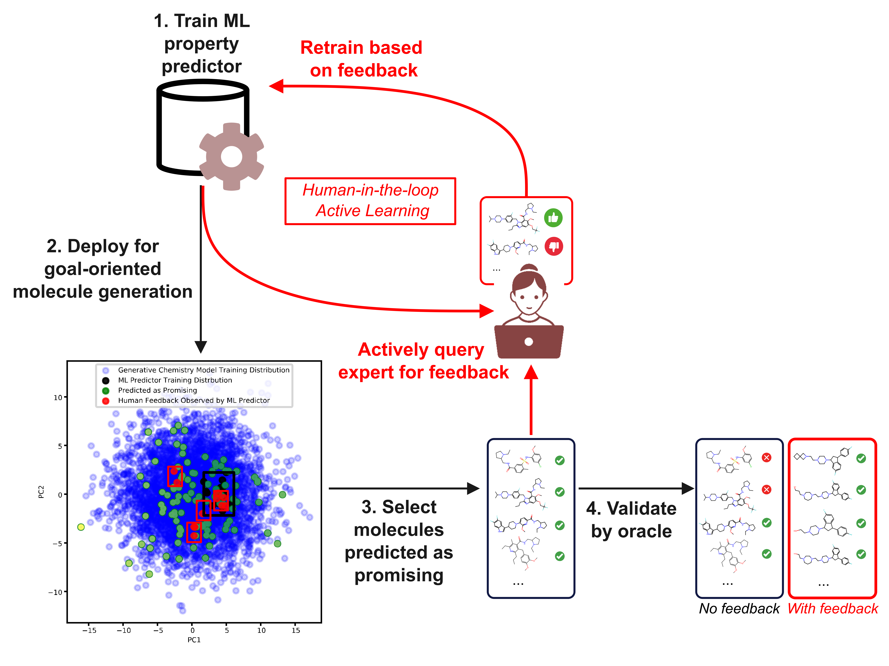

Human-in-the-loop Active Learning for Goal-Oriented Molecule Generation
=================================================================================================================

We present an interactive workflow to fine-tune predictive machine learning models for target molecular properties based on expert feedback and foster human-machine collaboration for goal-oriented molecular design and optimization.

In this study, we simulated the process of producing novel drug candidates using machine learning then validating them in the lab.

The goal is to generate a high number of successful top-scoring molecules (i.e., promising with respect to a target molecular property) according to both the machine learning predictive model, which scores the molecules at each iteration of the drug design process, and the lab simulator, which evaluates the best molecules at the end of the process.

Since simulators are expensive to query at each iteration of the drug design process, as well as for fine-tuning the predictive model iteratively (i.e., active learning), we mitigate this by allowing "weaker" oracles (i.e., human experts) to be queried for fine-tuning the predictive model (i.e., human-in-the-loop active learning).

Human experts supervised the predictive machine learning model that scores the molecules by accepting or refuting some of its predictions of top-scoring molecules. This improved the process' outcome by progressively aligning the machine-predicted probabilities of success with those of an experimental simulator and enhancing other metrics such as drug-likeness and synthetic accessibility.

This workflow uses [REINVENT 3.2](https://github.com/MolecularAI/Reinvent) for molecule generation.

System Requirements
-------------
- Python 3.7
- This code and `REINVENT 3.2` have been tested on Linux

Installation instructions
-------------
1. Install [Conda](https://conda.io/projects/conda/en/latest/index.html)
2. Clone this Git repository
3. In a shell terminal, go to the repository and clone the Reinvent repository from this [URL](https://github.com/MolecularAI/Reinvent)
4. Create the Conda environment for `REINVENT` using
   
        $ conda env create -f reinvent.yml

5. Active the environment then install `reinvent-scoring/` as a `pip` package using

        $ conda activate reinvent.v3.2
        $ pip install -e ./reinvent-scoring/
        $ conda deactivate

6. Copy or move the `reinvent.v3.2` environment directory in this repository, or modify its path in HITL_AL_GOMG/path.py

7. Create the Conda environment for the HITL-AL workflow using
   
        $ conda env create -f environment.yml

8. Activate the environment then install this repository as a `pip` package using
   
        $ conda activate hitl-al-gomg
        $ pip install -e .

Usage
-------------
Below are command examples for training a target property predictor (e.g., for DRD2 bioactivity) and running the workflow using a simulated expert.

* For training the predictor, go to `HITL_AL_GOMG/models/` then

        $ mkdir predictors simulators

In `simulators/`, you need to have a copy of the DRD2 bioactivity simulator (`drd2.pkl`) that you can download from this [URL](https://huggingface.co/yasminenahal/hitl-al-gomg-simulators/tree/main). Then you can run

        $ python train.py --task drd2 --path_to_param_grid ../../example_files/rfc_param_grid.json --train True --demo True

The directory `example_files/` contains examples of hyperparameter grids for `scikit-learn` Random Forest models.

* For running the workflow using a simulated expert

1. Create an output directory to store `REINVENT` generation results and change the variable `demos` in `HITL_AL_GOMG/path.py` with the corresponding path to your output directory
2. In `HITL_AL_GOMG/`, run a simulation
- without HITL active learning:

        $ python run.py --seed 3 --rounds 4 --num_opt_steps 100 --scoring_model drd2 --model_type classification --scoring_component_name bioactivity --threshold_value 0.5 --dirname demo_drd2 --init_train_set drd2_train --acquisition None --task drd2 --expert_model drd2

- with HITL active learning (e.g., entropy-based sampling):

        $ python run.py --seed 3 --rounds 4 --num_opt_steps 100 --scoring_model drd2 --model_type classification --scoring_component_name bioactivity --threshold_value 0.5 --dirname demo_drd2 --init_train_set drd2_train --acquisition entropy --al_iterations 5 --n_queries 10 --noise 0.1 --task drd2 --expert_model drd2

* For running final simulator evaluation and calculating metrics from [MOSES](https://github.com/molecularsets/moses) molecular generation benchmarking platform

1. In the `REINVENT` output directory, create a `data_for_figures/` directory to store all metric values
2. Go to `HITL_AL_GOMG/` and run

        $ python evaluate_results.py --job_name demo_drd2 --seed 2 --rounds 4 --n_opt_steps 100 --task drd2 --model_type classification --score_component_name bioactivity --scoring_model drd2 --init_data drd2 --acquisition entropy --al_iterations 5 --n_queries 10 --sigma_noise 0.1

Data
-------------
- We provide data for training the penalized LogP and DRD2 bioactivity predictors, as well as a sample from ChEMBL on which `REINVENT` prior agent was pre-trained.
- A copy of the `REINVENT` pre-trained prior agent is available at `HITL_AL_GOMG/models/priors/random.prior.new`.
- The experimental simulator for DRD2 bioactivity and the hERG model described in the multi-objective generation use case are available at this [URL](https://huggingface.co/yasminenahal/hitl-al-gomg-simulators/tree/main).
  
Jupyter notebooks
-------------
We also provide Jupyter notebooks with code to reproduce the paper's figures for both simulation and human experiments.

Acknowledgements
-------------
- We acknowledge the following works which were extremely helpful to develop this workflow:
  * Sundin, I., Voronov, A., Xiao, H. et al. Human-in-the-loop assisted de novo molecular design. J Cheminform 14, 86 (2022). [https://doi.org/10.1186/s13321-022-00667-8](https://doi.org/10.1186/s13321-022-00667-8)
  * Bickford Smith, F., Kirsch, A., Farquhar, S., Gal, Y., Foster, A., Rainforth, T. Prediction-oriented Bayesian active learning. International Conference on Artificial Intelligence and Statistics (2023). [https://arxiv.org/abs/2304.08151](https://arxiv.org/abs/2304.08151)
- We acknowledge the contribution of [Vincenzo Palmacci](https://github.com/vincenzo-palmacci) in refactoring parts of the code.
